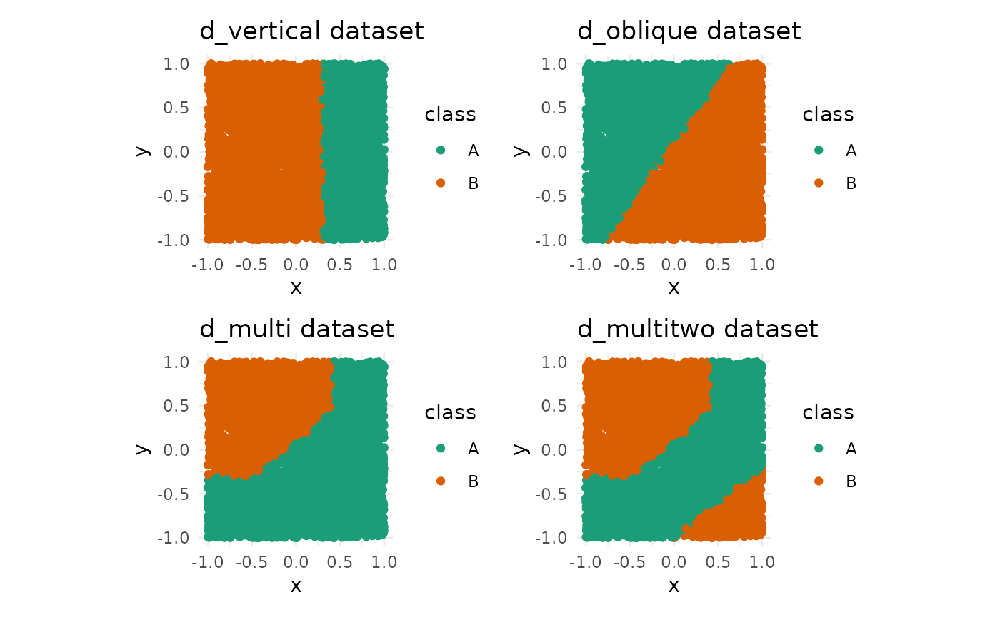
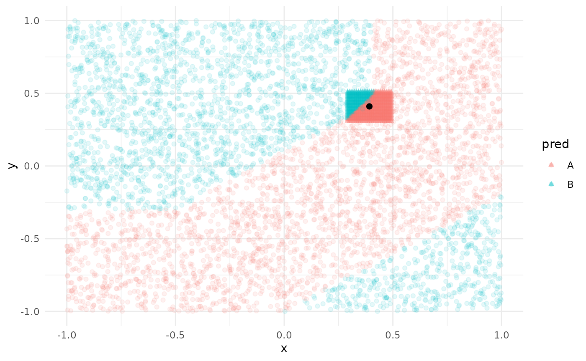

# Simple unit tests with in built-in datasets

``` r

library(kumquat)
options(repos = c(CRAN = "https://cloud.r-project.org"))
if(!requireNamespace("tidyverse")) {
  install.packages("tidyverse")
}
#> Loading required namespace: tidyverse
if(!requireNamespace("RColorBrewer")) {
  install.packages("RColorBrewer")
}
if(!requireNamespace("colorspace")) {
  install.packages("colorspace")
}
#> Loading required namespace: colorspace
if(!requireNamespace("patchwork")) {
  install.packages("patchwork")
}
#> Loading required namespace: patchwork
if(!requireNamespace("randomForest")) {
  install.packages("randomForest")
}
#> Loading required namespace: randomForest
library(tidyverse)
#> ── Attaching core tidyverse packages ──────────────────────── tidyverse 2.0.0 ──
#> ✔ dplyr     1.2.1     ✔ readr     2.2.0
#> ✔ forcats   1.0.1     ✔ stringr   1.6.0
#> ✔ ggplot2   4.0.3     ✔ tibble    3.3.1
#> ✔ lubridate 1.9.5     ✔ tidyr     1.3.2
#> ✔ purrr     1.2.2
#> ── Conflicts ────────────────────────────────────────── tidyverse_conflicts() ──
#> ✖ dplyr::filter() masks stats::filter()
#> ✖ dplyr::lag()    masks stats::lag()
#> ℹ Use the conflicted package (<http://conflicted.r-lib.org/>) to force all conflicts to become errors
library(RColorBrewer)
library(colorspace)
library(patchwork)
library(randomForest)
#> randomForest 4.7-1.2
#> Type rfNews() to see new features/changes/bug fixes.
#> 
#> Attaching package: 'randomForest'
#> 
#> The following object is masked from 'package:dplyr':
#> 
#>     combine
#> 
#> The following object is masked from 'package:ggplot2':
#> 
#>     margin
```

There are four sample datasets in the package, with varying complexities
in the decision boundary.

The datasets are as follows.

- d_vertical
- d_oblique
- d_multi
- d_multitwo

All of these datasets are made for a binary classification task. Each
dataset contains two numeric variables (`x`, `y`) and one categorical
variable (`class`). In this section, we will visualize the datasets
along with their decision boundary.

``` r


(d_vert_plot + d_obl_plot) / (d_multi_plot + d_multitwo_plot)
```



## Testing kumquat with the given datasets

### Models

    #> INFO [2026-06-16 04:24:16] Picking kumquats for row: 3090

``` r

# we expect the absolute importance of x to be greater for y
pinch_importance(ks)
#>           x        y
#> 1 -77.52714 54.32359
```

## Visualizing kumquat with the given datasets

``` r

plot_interest(ks)[[1]]
```


