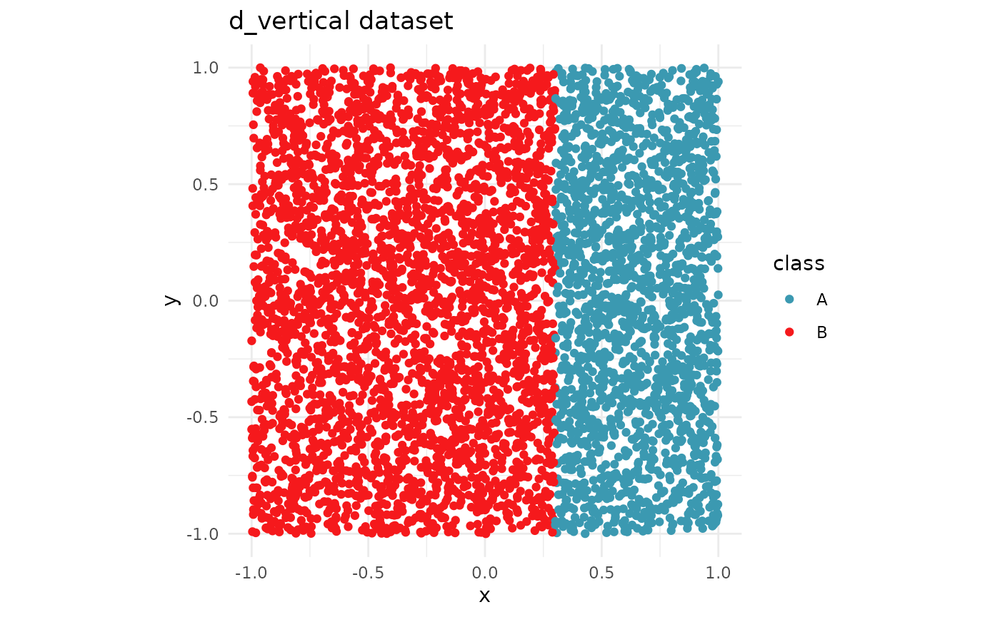
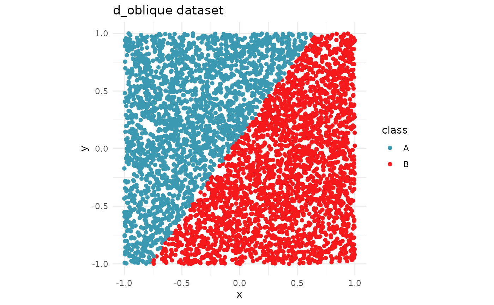
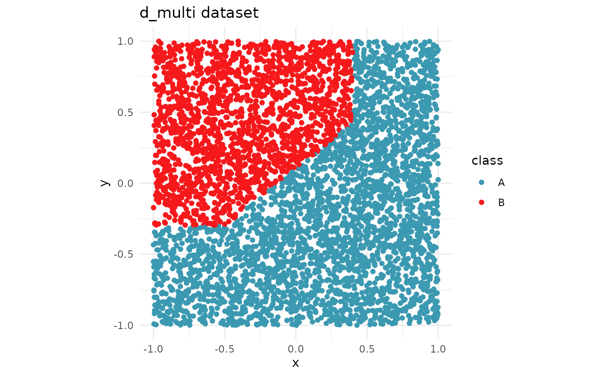
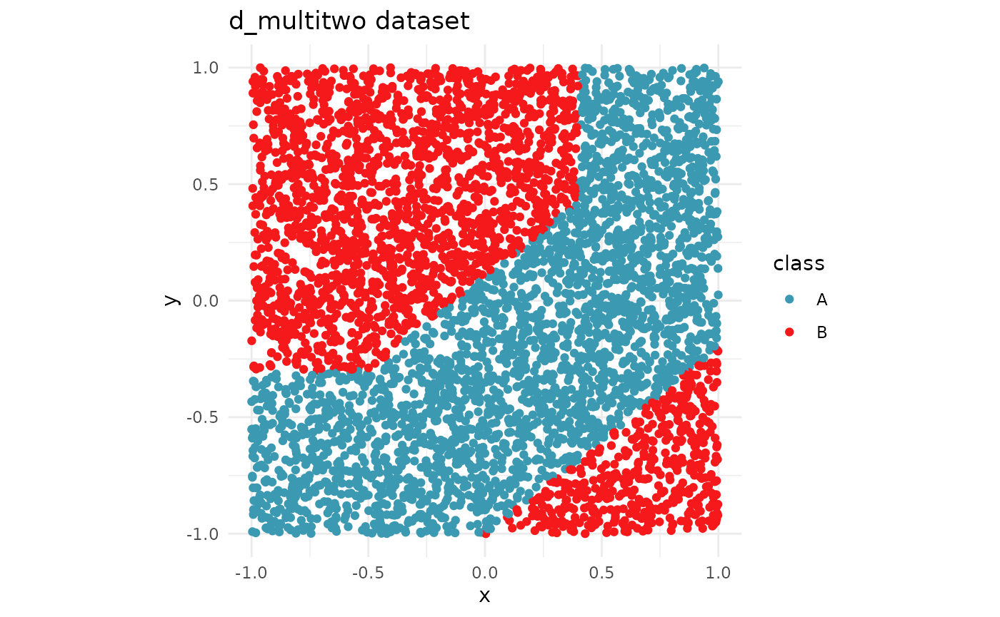

# data-examples

``` r
library(kumquat)

library(tidyverse)
#> ── Attaching core tidyverse packages ──────────────────────── tidyverse 2.0.0 ──
#> ✔ dplyr     1.2.1     ✔ readr     2.2.0
#> ✔ forcats   1.0.1     ✔ stringr   1.6.0
#> ✔ ggplot2   4.0.3     ✔ tibble    3.3.1
#> ✔ lubridate 1.9.5     ✔ tidyr     1.3.2
#> ✔ purrr     1.2.2     
#> ── Conflicts ────────────────────────────────────────── tidyverse_conflicts() ──
#> ✖ dplyr::filter() masks stats::filter()
#> ✖ dplyr::lag()    masks stats::lag()
#> ℹ Use the conflicted package (<http://conflicted.r-lib.org/>) to force all conflicts to become errors
library(colorspace)
```

There are four sample datasets in the package, with varying complexities
in the decision boundary.

The datasets are as follows.

- d_vertical
- d_oblique
- d_multi
- d_multitwo

All of these datasets are made for a binary classification task. Each
dataset contains two numeric variables (`x`, `y`) and one categorical
variable (`class`). In this section, we will visualize the datasets
along with their decision boundary.

## `d_vertical` dataset

``` r
data("d_vertical")

ggplot(d_vertical, aes(x = x, y = y, colour = class)) +
  geom_point() +
  scale_colour_discrete_divergingx(palette = "Zissou 1") +
  theme_minimal() +
  theme(aspect.ratio = 1) +
  labs(title = "d_vertical dataset")
```



## `d_oblique` dataset

``` r
data(d_oblique, package="kumquat")
ggplot(data=d_oblique, aes(x = x, y = y, colour = class)) +
  geom_point() +
  scale_colour_discrete_divergingx(palette = "Zissou 1") +
  theme_minimal() +
  theme(aspect.ratio = 1) +
  labs(title = "d_oblique dataset")
```



## `d_multi` dataset

``` r
data("d_multi")

ggplot(d_multi, aes(x = x, y = y, colour = class)) +
  geom_point() +
  scale_colour_discrete_divergingx(palette = "Zissou 1") +
  theme_minimal() +
  theme(aspect.ratio = 1) +
  labs(title = "d_multi dataset")
```



## `d_multitwo` dataset

``` r
data("d_multitwo")

ggplot(d_multitwo, aes(x = x, y = y, colour = class)) +
  geom_point() +
  scale_colour_discrete_divergingx(palette = "Zissou 1") +
  theme_minimal() +
  theme(aspect.ratio = 1) +
  labs(title = "d_multitwo dataset")
```



## Testing kumquat with the given datasets

### Models

``` r
library(randomForest)
#> randomForest 4.7-1.2
#> Type rfNews() to see new features/changes/bug fixes.
#> 
#> Attaching package: 'randomForest'
#> The following object is masked from 'package:dplyr':
#> 
#>     combine
#> The following object is masked from 'package:ggplot2':
#> 
#>     margin

rf_vertical <- randomForest(class ~ ., data = d_vertical)
rf_vertical_bundle <- bundle::bundle(rf_vertical)
```

``` r
find_closest <- function(pt, data) {
  dst <- data |>
    mutate(dst = sqrt((x - pt$x)^2 + (y - pt$y)^2))
  return(which.min(dst$dst))
}
```

``` r
pt <- tibble(x=0.3, y=0)
obs <- find_closest(pt, d_vertical)

ks <- kumquat(
  rf_vertical_bundle,
  d_vertical,
  obs,
  class_names = unique(d_vertical$class)
)
#> INFO [2026-04-28 02:24:52] Picking kumquats for row: 3470
```

``` r
# we expect the absolute importance of x to be greater for y
abs(ks[[1]]$local_model$importances["x"]) > abs(ks[[1]]$local_model$importances["y"])
#>    x 
#> TRUE
```
