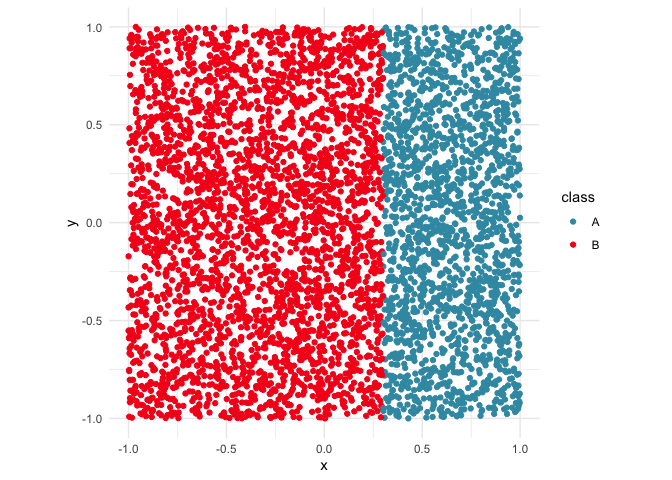

# kumquat

The goal of kumquat is to be a smaller simpler implementation of LIME.
This is purely for demonstration purposes, and is not ideal to be used
in production settings.

Kumquat is super easy to use. First you get your data set up and your
model set up. Then you decide the data points of interest and kumquat
will give you a list of information for each point you selected.

Below we will go through a step-by-step guide on setting up kumquats to
be used.

## Installation

You can install the development version of kumquat like so:

``` r
pak::pak("janithwanni/kumquat")
```

## Load package

``` r
library(kumquat)
```

## Limitations

- Currently `kumquat` only supports datasets of two numeric variables
  and one categorical variable.

## Usage

### Step 1: Load Data

``` r
library(tidyverse)
#> ── Attaching core tidyverse packages ──────────────────────── tidyverse 2.0.0 ──
#> ✔ dplyr     1.2.0     ✔ readr     2.2.0
#> ✔ forcats   1.0.1     ✔ stringr   1.6.0
#> ✔ ggplot2   4.0.2     ✔ tibble    3.3.1
#> ✔ lubridate 1.9.5     ✔ tidyr     1.3.2
#> ✔ purrr     1.2.1     
#> ── Conflicts ────────────────────────────────────────── tidyverse_conflicts() ──
#> ✖ dplyr::filter() masks stats::filter()
#> ✖ dplyr::lag()    masks stats::lag()
#> ℹ Use the conflicted package (<http://conflicted.r-lib.org/>) to force all conflicts to become errors
library(colorspace)

data(d_vertical)

ggplot(d_vertical, aes(x = x, y = y, colour = class)) +
  geom_point() +
  scale_colour_discrete_divergingx(palette = "Zissou 1") +
  theme_minimal() +
  theme(aspect.ratio = 1)
```



### Step 2: Bundling the model

When setting up the model, kumquat expects a `bundle` object containing
the model and its reference pointers.

``` r
library(randomForest)
#> randomForest 4.7-1.2
#> Type rfNews() to see new features/changes/bug fixes.
#> 
#> Attaching package: 'randomForest'
#> The following object is masked from 'package:dplyr':
#> 
#>     combine
#> The following object is masked from 'package:ggplot2':
#> 
#>     margin
library(bundle)

# Get model ready
rfmodel <- randomForest(
  class ~ x + y,
  data = d_vertical
)

# Bundle model up
rfmodel_bundled <- bundle(rfmodel)
```

### Step 3: Decide on points of interest

``` r
# Decide on points of interest
find_closest <- function(pt, data) {
  dst <- data |>
    mutate(dst = sqrt((x - pt$x)^2 + (y - pt$y)^2))
  return(which.min(dst$dst))
}

pois <- c(
  # Case 1: the point of interest is not near the boundary
  find_closest(tibble(x=0, y=0), d_vertical),
  # Case 2: the point is on the decision boundary
  find_closest(tibble(x=0.3, y=0.5), d_vertical)
)
```

``` r
ggplot(d_vertical, aes(x = x, y = y, colour = class)) +
  geom_point() +
  geom_point(data=d_vertical[pois, ], mapping=aes(x=x,y=y,fill=class), shape = 18, color = "black") +
  scale_colour_discrete_divergingx(palette = "Zissou 1") +
  theme_minimal() +
  theme(aspect.ratio = 1)
```


#### Step 4: Build kumquat

``` r
# Run kumquat
ks <- kumquat(
  rfmodel_bundled,
  d_vertical,
  pois,
  class_names = unique(d_vertical$class)
)
```

#### Step 5: Examine the outputs

##### Case 1: The point is not near the decision boundary

In this case, according to `ks[[1]]$local_model$importances` both `x`
and `y` are equally important.

``` r
# str(ks)
ks[[1]]
#> $perturbations
#> # A tibble: 441 × 3
#>         x        y pred 
#>     <dbl>    <dbl> <fct>
#>  1 -0.105 -0.0966  B    
#>  2 -0.105 -0.0866  B    
#>  3 -0.105 -0.0766  B    
#>  4 -0.105 -0.0666  B    
#>  5 -0.105 -0.0566  B    
#>  6 -0.105 -0.0466  B    
#>  7 -0.105 -0.0366  B    
#>  8 -0.105 -0.0266  B    
#>  9 -0.105 -0.0166  B    
#> 10 -0.105 -0.00659 B    
#> # ℹ 431 more rows
#> 
#> $local_model
#> $local_model$glm_predictions
#> 1 
#> B 
#> Levels: A B
#> 
#> $local_model$importances
#>   x   y 
#> 0.5 0.5 
#> 
#> $local_model$model
#> NULL
#> 
#> 
#> $point_of_interest
#> [1] 912
#> 
#> $train_data
#> # A tibble: 5,000 × 3
#>         x      y class
#>     <dbl>  <dbl> <fct>
#>  1  0.885  0.615 A    
#>  2 -0.264  0.649 B    
#>  3  0.190  0.197 B    
#>  4 -0.752 -0.749 B    
#>  5 -0.817  0.661 B    
#>  6  0.533 -0.305 A    
#>  7  0.695  0.154 A    
#>  8  0.143 -0.300 B    
#>  9 -0.647 -0.795 B    
#> 10  0.300  0.739 B    
#> # ℹ 4,990 more rows
```

##### Case 2: The point is near the decision boundary

In this case, according to `ks[[2]]$local_model$importances`, `x` has an
importance of -1000.3018471 and `y` has an importance of 0. Since the
decision boundary was made using just the `x` variable we would expect
the `x` variable to be more important in the model’s decision making
process.

``` r
# str(ks)
ks[[2]]
#> $perturbations
#> # A tibble: 441 × 3
#>        x     y pred 
#>    <dbl> <dbl> <fct>
#>  1 0.214 0.408 B    
#>  2 0.214 0.418 B    
#>  3 0.214 0.428 B    
#>  4 0.214 0.438 B    
#>  5 0.214 0.448 B    
#>  6 0.214 0.458 B    
#>  7 0.214 0.468 B    
#>  8 0.214 0.478 B    
#>  9 0.214 0.488 B    
#> 10 0.214 0.498 B    
#> # ℹ 431 more rows
#> 
#> $local_model
#> $local_model$glm_predictions
#>        lambda.min
#>   [1,]          2
#>   [2,]          2
#>   [3,]          2
#>   [4,]          2
#>   [5,]          2
#>   [6,]          2
#>   [7,]          2
#>   [8,]          2
#>   [9,]          2
#>  [10,]          2
#>  [11,]          2
#>  [12,]          2
#>  [13,]          2
#>  [14,]          2
#>  [15,]          2
#>  [16,]          2
#>  [17,]          2
#>  [18,]          2
#>  [19,]          2
#>  [20,]          2
#>  [21,]          2
#>  [22,]          2
#>  [23,]          2
#>  [24,]          2
#>  [25,]          2
#>  [26,]          2
#>  [27,]          2
#>  [28,]          2
#>  [29,]          2
#>  [30,]          2
#>  [31,]          2
#>  [32,]          2
#>  [33,]          2
#>  [34,]          2
#>  [35,]          2
#>  [36,]          2
#>  [37,]          2
#>  [38,]          2
#>  [39,]          2
#>  [40,]          2
#>  [41,]          2
#>  [42,]          2
#>  [43,]          2
#>  [44,]          2
#>  [45,]          2
#>  [46,]          2
#>  [47,]          2
#>  [48,]          2
#>  [49,]          2
#>  [50,]          2
#>  [51,]          2
#>  [52,]          2
#>  [53,]          2
#>  [54,]          2
#>  [55,]          2
#>  [56,]          2
#>  [57,]          2
#>  [58,]          2
#>  [59,]          2
#>  [60,]          2
#>  [61,]          2
#>  [62,]          2
#>  [63,]          2
#>  [64,]          2
#>  [65,]          2
#>  [66,]          2
#>  [67,]          2
#>  [68,]          2
#>  [69,]          2
#>  [70,]          2
#>  [71,]          2
#>  [72,]          2
#>  [73,]          2
#>  [74,]          2
#>  [75,]          2
#>  [76,]          2
#>  [77,]          2
#>  [78,]          2
#>  [79,]          2
#>  [80,]          2
#>  [81,]          2
#>  [82,]          2
#>  [83,]          2
#>  [84,]          2
#>  [85,]          2
#>  [86,]          2
#>  [87,]          2
#>  [88,]          2
#>  [89,]          2
#>  [90,]          2
#>  [91,]          2
#>  [92,]          2
#>  [93,]          2
#>  [94,]          2
#>  [95,]          2
#>  [96,]          2
#>  [97,]          2
#>  [98,]          2
#>  [99,]          2
#> [100,]          2
#> [101,]          2
#> [102,]          2
#> [103,]          2
#> [104,]          2
#> [105,]          2
#> [106,]          2
#> [107,]          2
#> [108,]          2
#> [109,]          2
#> [110,]          2
#> [111,]          2
#> [112,]          2
#> [113,]          2
#> [114,]          2
#> [115,]          2
#> [116,]          2
#> [117,]          2
#> [118,]          2
#> [119,]          2
#> [120,]          2
#> [121,]          2
#> [122,]          2
#> [123,]          2
#> [124,]          2
#> [125,]          2
#> [126,]          2
#> [127,]          2
#> [128,]          2
#> [129,]          2
#> [130,]          2
#> [131,]          2
#> [132,]          2
#> [133,]          2
#> [134,]          2
#> [135,]          2
#> [136,]          2
#> [137,]          2
#> [138,]          2
#> [139,]          2
#> [140,]          2
#> [141,]          2
#> [142,]          2
#> [143,]          2
#> [144,]          2
#> [145,]          2
#> [146,]          2
#> [147,]          2
#> [148,]          2
#> [149,]          2
#> [150,]          2
#> [151,]          2
#> [152,]          2
#> [153,]          2
#> [154,]          2
#> [155,]          2
#> [156,]          2
#> [157,]          2
#> [158,]          2
#> [159,]          2
#> [160,]          2
#> [161,]          2
#> [162,]          2
#> [163,]          2
#> [164,]          2
#> [165,]          2
#> [166,]          2
#> [167,]          2
#> [168,]          2
#> [169,]          2
#> [170,]          2
#> [171,]          2
#> [172,]          2
#> [173,]          2
#> [174,]          2
#> [175,]          2
#> [176,]          2
#> [177,]          2
#> [178,]          2
#> [179,]          2
#> [180,]          2
#> [181,]          2
#> [182,]          2
#> [183,]          2
#> [184,]          2
#> [185,]          2
#> [186,]          2
#> [187,]          2
#> [188,]          2
#> [189,]          2
#> [190,]          1
#> [191,]          1
#> [192,]          1
#> [193,]          1
#> [194,]          1
#> [195,]          1
#> [196,]          1
#> [197,]          1
#> [198,]          1
#> [199,]          1
#> [200,]          1
#> [201,]          1
#> [202,]          1
#> [203,]          1
#> [204,]          1
#> [205,]          1
#> [206,]          1
#> [207,]          1
#> [208,]          1
#> [209,]          1
#> [210,]          1
#> [211,]          1
#> [212,]          1
#> [213,]          1
#> [214,]          1
#> [215,]          1
#> [216,]          1
#> [217,]          1
#> [218,]          1
#> [219,]          1
#> [220,]          1
#> [221,]          1
#> [222,]          1
#> [223,]          1
#> [224,]          1
#> [225,]          1
#> [226,]          1
#> [227,]          1
#> [228,]          1
#> [229,]          1
#> [230,]          1
#> [231,]          1
#> [232,]          1
#> [233,]          1
#> [234,]          1
#> [235,]          1
#> [236,]          1
#> [237,]          1
#> [238,]          1
#> [239,]          1
#> [240,]          1
#> [241,]          1
#> [242,]          1
#> [243,]          1
#> [244,]          1
#> [245,]          1
#> [246,]          1
#> [247,]          1
#> [248,]          1
#> [249,]          1
#> [250,]          1
#> [251,]          1
#> [252,]          1
#> [253,]          1
#> [254,]          1
#> [255,]          1
#> [256,]          1
#> [257,]          1
#> [258,]          1
#> [259,]          1
#> [260,]          1
#> [261,]          1
#> [262,]          1
#> [263,]          1
#> [264,]          1
#> [265,]          1
#> [266,]          1
#> [267,]          1
#> [268,]          1
#> [269,]          1
#> [270,]          1
#> [271,]          1
#> [272,]          1
#> [273,]          1
#> [274,]          1
#> [275,]          1
#> [276,]          1
#> [277,]          1
#> [278,]          1
#> [279,]          1
#> [280,]          1
#> [281,]          1
#> [282,]          1
#> [283,]          1
#> [284,]          1
#> [285,]          1
#> [286,]          1
#> [287,]          1
#> [288,]          1
#> [289,]          1
#> [290,]          1
#> [291,]          1
#> [292,]          1
#> [293,]          1
#> [294,]          1
#> [295,]          1
#> [296,]          1
#> [297,]          1
#> [298,]          1
#> [299,]          1
#> [300,]          1
#> [301,]          1
#> [302,]          1
#> [303,]          1
#> [304,]          1
#> [305,]          1
#> [306,]          1
#> [307,]          1
#> [308,]          1
#> [309,]          1
#> [310,]          1
#> [311,]          1
#> [312,]          1
#> [313,]          1
#> [314,]          1
#> [315,]          1
#> [316,]          1
#> [317,]          1
#> [318,]          1
#> [319,]          1
#> [320,]          1
#> [321,]          1
#> [322,]          1
#> [323,]          1
#> [324,]          1
#> [325,]          1
#> [326,]          1
#> [327,]          1
#> [328,]          1
#> [329,]          1
#> [330,]          1
#> [331,]          1
#> [332,]          1
#> [333,]          1
#> [334,]          1
#> [335,]          1
#> [336,]          1
#> [337,]          1
#> [338,]          1
#> [339,]          1
#> [340,]          1
#> [341,]          1
#> [342,]          1
#> [343,]          1
#> [344,]          1
#> [345,]          1
#> [346,]          1
#> [347,]          1
#> [348,]          1
#> [349,]          1
#> [350,]          1
#> [351,]          1
#> [352,]          1
#> [353,]          1
#> [354,]          1
#> [355,]          1
#> [356,]          1
#> [357,]          1
#> [358,]          1
#> [359,]          1
#> [360,]          1
#> [361,]          1
#> [362,]          1
#> [363,]          1
#> [364,]          1
#> [365,]          1
#> [366,]          1
#> [367,]          1
#> [368,]          1
#> [369,]          1
#> [370,]          1
#> [371,]          1
#> [372,]          1
#> [373,]          1
#> [374,]          1
#> [375,]          1
#> [376,]          1
#> [377,]          1
#> [378,]          1
#> [379,]          1
#> [380,]          1
#> [381,]          1
#> [382,]          1
#> [383,]          1
#> [384,]          1
#> [385,]          1
#> [386,]          1
#> [387,]          1
#> [388,]          1
#> [389,]          1
#> [390,]          1
#> [391,]          1
#> [392,]          1
#> [393,]          1
#> [394,]          1
#> [395,]          1
#> [396,]          1
#> [397,]          1
#> [398,]          1
#> [399,]          1
#> [400,]          1
#> [401,]          1
#> [402,]          1
#> [403,]          1
#> [404,]          1
#> [405,]          1
#> [406,]          1
#> [407,]          1
#> [408,]          1
#> [409,]          1
#> [410,]          1
#> [411,]          1
#> [412,]          1
#> [413,]          1
#> [414,]          1
#> [415,]          1
#> [416,]          1
#> [417,]          1
#> [418,]          1
#> [419,]          1
#> [420,]          1
#> [421,]          1
#> [422,]          1
#> [423,]          1
#> [424,]          1
#> [425,]          1
#> [426,]          1
#> [427,]          1
#> [428,]          1
#> [429,]          1
#> [430,]          1
#> [431,]          1
#> [432,]          1
#> [433,]          1
#> [434,]          1
#> [435,]          1
#> [436,]          1
#> [437,]          1
#> [438,]          1
#> [439,]          1
#> [440,]          1
#> [441,]          1
#> 
#> $local_model$importances
#>         x         y 
#> -1000.302     0.000 
#> 
#> $local_model$coef_mat
#>             lambda.min
#> (Intercept)   298.9126
#> x           -1000.3018
#> y               0.0000
#> 
#> $local_model$model
#> 
#> Call:  glmnet::cv.glmnet(x = X, y = y, nfolds = nfolds, family = "binomial",      alpha = alpha) 
#> 
#> Measure: Binomial Deviance 
#> 
#>        Lambda Index  Measure        SE Nonzero
#> min 5.115e-05    98 0.001368 0.0002150       1
#> 1se 5.614e-05    97 0.001496 0.0002354       1
#> 
#> 
#> $point_of_interest
#> [1] 1915
#> 
#> $train_data
#> # A tibble: 5,000 × 3
#>         x      y class
#>     <dbl>  <dbl> <fct>
#>  1  0.885  0.615 A    
#>  2 -0.264  0.649 B    
#>  3  0.190  0.197 B    
#>  4 -0.752 -0.749 B    
#>  5 -0.817  0.661 B    
#>  6  0.533 -0.305 A    
#>  7  0.695  0.154 A    
#>  8  0.143 -0.300 B    
#>  9 -0.647 -0.795 B    
#> 10  0.300  0.739 B    
#> # ℹ 4,990 more rows
```

The output from `kumquat` will be a list containing the following
elements.

1.  perturbations: A data.frame of perturbations used to fit the local
    model

2.  local_model: Details of the glmnet model fit. This is also a list
    containing the following elements. In the case where the point of
    interest is not near the model’s decision boundary, the `model`
    component will be NULL and the importances will be distributted
    equally.

3.  glm_predictions

4.  importances: The importances of each feature

5.  coef_mat: The coefficients

6.  model: the glm_net model object

7.  point_of_interest

8.  train_data
